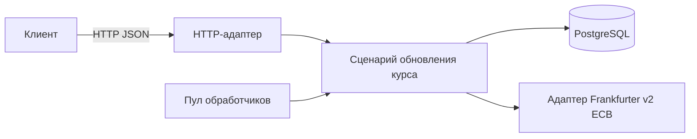
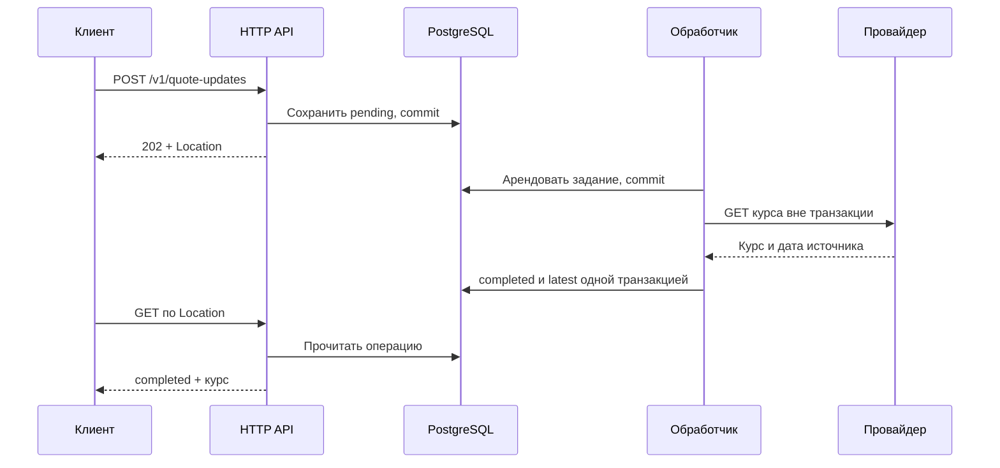
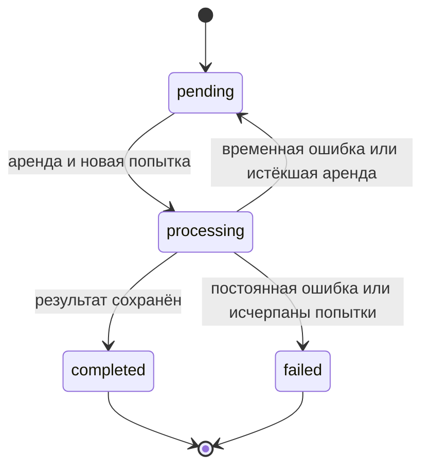
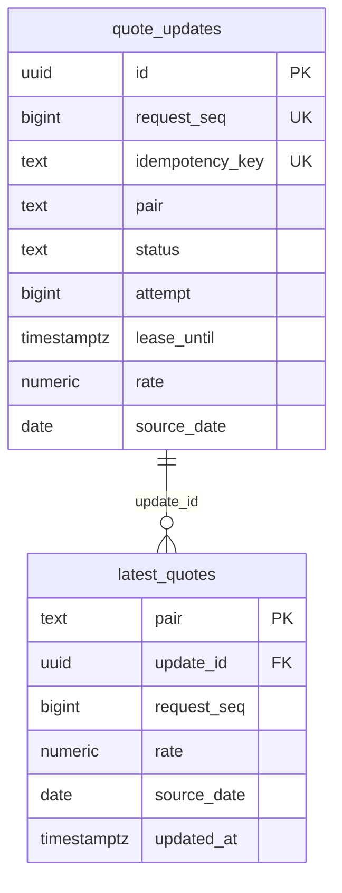

# fx-quotes

Сервис получает ежедневные справочные курсы Frankfurter/ECB в фоне. Хранит состояние каждого обновления и последний
успешный курс. Поддерживает шесть направлений: `USD/EUR`, `USD/MXN`, `EUR/USD`, `EUR/MXN`, `MXN/USD`, `MXN/EUR`.

## Запуск

```sh
cp .env.example .env
docker compose up --build
```

В другом терминале:

```sh
curl http://127.0.0.1:8080/health/ready
```

HTTP доступен только на `127.0.0.1:8080`. PostgreSQL хранит данные в именованном томе. Принятые задания сохраняются при
`docker compose restart app`.

Для запуска без Docker нужны Go ≥ 1.25.14 и PostgreSQL. Задайте `FX_QUOTES_DATABASE_URL` в окружении, затем выполните
`go run ./cmd/fx-quotes`. Само приложение не читает `.env`. По умолчанию оно слушает `127.0.0.1:8080`. В Compose указан
адрес `:8080` внутри контейнера.

## API

Создать обновление:

```sh
curl -i http://127.0.0.1:8080/v1/quote-updates \
  -H 'Content-Type: application/json' \
  -H 'Idempotency-Key: example-20260922-1' \
  --data '{"pair":"USD/EUR"}'
```

Ответ `202` содержит `Location`. Подставьте ID и опрашивайте операцию до `completed` или `failed`:

```sh
curl http://127.0.0.1:8080/v1/quote-updates/PUT-THE-ID-HERE
```

Прочитать последний успешный курс:

```sh
curl --get --data-urlencode 'pair=USD/EUR' \
  http://127.0.0.1:8080/v1/quotes/latest
```

Повтор исходного POST с тем же ключом и парой вернёт `200` с прежним ID, не занимая место в очереди. Курс передаётся
точной десятичной строкой, без `float64`.

`/health/live` проверяет HTTP-процесс. `/health/ready` дополнительно проверяет БД и возвращает ошибку при остановке
сервиса. Продвижение очереди эти маршруты не проверяют.

Форматы запросов, ограничения и ошибки описаны в [OpenAPI](api/openapi.yaml).
Спецификация также доступна на [`/openapi.yaml`](http://127.0.0.1:8080/openapi.yaml).

## Архитектура

Домен и сценарии не зависят от HTTP, PostgreSQL и провайдера. Сценарии обращаются к ним через интерфейсы.
Адаптеры реализуют эти интерфейсы, `internal/app` собирает зависимости через конструкторы.
Структуры HTTP-запросов и ответов (DTO) отделены от домена.



Читать код удобно в таком порядке:

| Каталог                         | За что отвечает                                                                                                     |
|---------------------------------|---------------------------------------------------------------------------------------------------------------------|
| `internal/entity`               | Валютные пары, точный курс, состояние операции `QuoteUpdate`                                                        |
| `internal/usecase/quote`        | `Service` создаёт и обрабатывает задания. `Store` и `RateProvider` описывают внешние зависимости                    |
| `internal/adapter/postgres`     | `store.go` принимает и читает задания, `queue.go` управляет обработкой, `row.go` преобразует строки БД              |
| `internal/adapter/worker`       | Пул обработчиков, polling и восстановление                                                                          |
| `internal/adapter/httpapi`      | `router.go` задаёт маршруты, `handler.go` содержит обработчики, `request.go`/`response.go` отвечают за вход и выход |
| `internal/adapter/frankfurter`  | HTTP-клиент провайдера и проверка его ответа                                                                        |
| `internal/app`, `cmd/fx-quotes` | Конфигурация, сборка, запуск и остановка                                                                            |

### Обработка запроса



После сохранения задания сигнал будит одного обработчика. При восстановлении группы заданий просыпаются несколько.
Если сигнал потерялся, задание найдётся при опросе БД. Запрос к провайдеру идёт вне SQL-транзакции
и может повторяться (`at least once`).

Приём заданий защищён транзакционной блокировкой `advisory lock` между экземплярами с одинаковым `MAX_ACTIVE`.
Под блокировкой один SQL-запрос ищет ключ повтора, проверяет место в очереди и добавляет задание.
Локальный ограничитель не даёт ожидающим POST занять весь SQL-пул. Время ожидания ограничено HTTP-дедлайном.

### Состояния и перезапуск



- Обработчик арендует задание (lease). Проверка статуса и номера попытки `attempt` защищает от записи старого
  обработчика после восстановления или нового захвата (fencing). Одно лишь истечение аренды запись не запрещает.
- При 408/429/500/502/503/504 и `UnexpectedEOF` запрос повторяется с растущей задержкой и случайным разбросом
  (backoff/jitter). Постоянная ошибка или исчерпание попыток дают `failed`. Прежний успешный курс остаётся.
- Восстановление обрабатывает до 100 строк за транзакцию, пропуская заблокированные через `SKIP LOCKED`.
  Все фоновые SQL-операции имеют тайм-аут 1 с, включая ожидание соединения и блокировок.
  При своём тайм-ауте восстановление уменьшает пакет вдвое, вплоть до одной строки, и сохраняет размер до перезапуска.
  Между непустыми пакетами ждёт `min(POLL_INTERVAL, RECOVERY_INTERVAL)`, после пустого возвращается к обычному интервалу.
  Недоступная БД или строка, которую нельзя обработать за секунду, задержат восстановление.
- При SIGINT/SIGTERM сервис снимает готовность, ждёт HTTP-запросы, затем отменяет обработчики и запросы к провайдеру.
  По дедлайну принудительно закрывает HTTP и отменяет ожидание БД. Незавершённые задания восстановятся после истечения аренды.

### Данные



На схеме основные поля, ограничения и индексы описаны в [миграции](internal/adapter/postgres/migrations/001_quotes.sql).
В `latest_quotes` одна строка на пару. Побеждает более поздняя дата источника, при равной дате учитывается порядок приёма
запросов. Состояния меняются в PostgreSQL и проверяются тестами с настоящей БД.

[Frankfurter v2 / ECB](https://frankfurter.dev/docs/) публикует справочные курсы: дата остаётся прежней до новой
публикации, включая выходные.

Очередь и результат хранятся в одной БД, поэтому отдельный брокер и outbox здесь не нужны.
Сервис рассчитан на одного пользователя и локальный запуск через Compose. Очистка истории и восстановление из резервных
копий не реализованы. Для публичного запуска нужны авторизация, TLS и настройка инфраструктуры.

## Настройки

Все переменные собраны в [.env.example](.env.example), допустимые диапазоны
проверяет [config.go](internal/app/config/config.go). Основные настройки:

| Переменная                   | По умолчанию | Ограничение                                            |
|------------------------------|--------------|--------------------------------------------------------|
| `FX_QUOTES_WORKER_COUNT`     | `2`          | От 1 до 64                                             |
| `FX_QUOTES_MAX_ACTIVE`       | `100`        | От 1 до 10 000 операций `pending` + `processing`       |
| `FX_QUOTES_MAX_ATTEMPTS`     | `3`          | От 1 до 10 попыток обработки                           |
| `FX_QUOTES_PROVIDER_TIMEOUT` | `5s`         | От `10ms` до `5m`                                      |
| `FX_QUOTES_REQUEST_TIMEOUT`  | `5s`         | От `10ms` до `5m`, включая ожидание БД                 |
| `FX_QUOTES_LEASE_DURATION`   | `15s`        | От `1s` до `10m`, не меньше тайм-аута провайдера + 1 с |

64 обработчика могут работать с SQL-пулом до 16 соединений: БД нужна при захвате и завершении попытки,
а во время запроса к провайдеру соединение свободно. Больше обработчиков не всегда означает быстрее.

- При неверной конфигурации сервис не запускается. Тайм-аут записи HTTP должен превышать `REQUEST_TIMEOUT`,
  чтобы сервис успел вернуть ошибку.
- `FX_QUOTES_DATABASE_URL` имеет приоритет и не может быть пустым. Если переменная не задана, URL собирается из компонентов
  с экранированием. Для удалённой БД включён TLS (`verify-full`). Исключения: loopback IP и точный `DATABASE_INSECURE_HOST`
  (в Compose это `postgres`). При явном URL TLS определяется самим URL, включая `sslmode=disable`.
- Внешний порт задаёт `FX_QUOTES_HOST_PORT`. Для смены внутреннего согласуйте `LISTEN_ADDR`, `CONTAINER_PORT` и
  `HEALTHCHECK_URL` с префиксом `FX_QUOTES_`. Для штатной остановки `STOP_GRACE_PERIOD` должен превышать `SHUTDOWN_TIMEOUT`.
  Примеры в `.env.example`.

Реквизиты БД, ключи идемпотентности и тела запросов в логи не попадают.
Ошибки записываются как безопасная категория и тип, panic также содержит стек.

## Проверки

### Локально

Для тестов с БД укажите URL отдельной тестовой базы:

```sh
make fmt-check vet test test-race build
TEST_DATABASE_URL='postgres://USER@127.0.0.1:55439/postgres?sslmode=disable' make test-integration
make openapi compose-config compose-load-config
go run golang.org/x/vuln/cmd/govulncheck@v1.1.4 ./...
```

`test-integration` требует URL, работает без кэша. Обычный `go test` без URL пропускает проверки с БД.
Проверяются перезапуск, потеря ответа, SQL-дедлайны, 64 обработчика и 10 000 заданий в очереди.
Папка `test/`: архитектурные проверки, Compose/smoke, тестовый провайдер. В рабочий бинарник не входят.

[Тест с `SIGKILL`](internal/app/process_restart_test.go) убивает процесс во время запроса к провайдеру.
После перезапуска проверяет восстановление той же операции, вторую попытку и `latest`.
Входит в integration/race на Linux/macOS с URL БД. Дочерний бинарник без race, отказ БД и потеря диска не проверяются.
Отдельно: `go test ./internal/app -run SIGKILL -count=3` с `TEST_DATABASE_URL`.

Fuzz для курсов и JSON:

```sh
go test ./internal/entity -run '^$' -fuzz FuzzRateRoundTrip -fuzztime 15s
go test ./internal/adapter/httpapi -run '^$' -fuzz FuzzDecodePair -fuzztime 15s
```

### CI

[GitHub Actions](https://github.com/Timofey121/fx-quotes/actions) запускается на PR и push в `main`.
Проверяет форматирование, vet, `go mod verify`, race/integration, OpenAPI, govulncheck, сборку, Compose и два контейнерных smoke.

Actions закреплены полными SHA, checkout не сохраняет Git-учётные данные. Лимит 20 минут,
стенд `fx-quotes-ci` удаляется с данными. Нагрузка, длительный fuzz и production-deployment в CI не входят.

## Нагрузка

[compose.load.yaml](compose.load.yaml): отдельная БД и тестовый провайдер, 64 обработчика,
до 100 активных заданий, порт 18080, курс `0.9234` с задержкой `100ms`. Нужны Docker, k6, `curl` и `jq` для smoke.

Обычные URL БД и провайдера не используются, запросов к публичному API нет.
Не объединяйте стенд с `compose.yaml` и не запускайте замер параллельно со сборкой или fuzz.

```sh
docker compose -p fx-quotes-load -f compose.load.yaml up --build -d --wait
FX_QUOTES_SMOKE_URL=http://127.0.0.1:18080 FX_QUOTES_SMOKE_EXPECTED_RATE=0.9234 make smoke
k6 run -e FX_QUOTES_K6_BASE_URL=http://127.0.0.1:18080 \
  -e FX_QUOTES_K6_START_RATE=100 -e FX_QUOTES_K6_TARGET_RATE=100 \
  -e FX_QUOTES_K6_RAMP_DURATION=1s -e FX_QUOTES_K6_STEADY_DURATION=30s \
  -e FX_QUOTES_K6_RAMP_DOWN_DURATION=1s \
  -e FX_QUOTES_K6_PREALLOCATED_VUS=100 -e FX_QUOTES_K6_MAX_VUS=200 \
  k6/scripts/async-quotes.js
docker compose -p fx-quotes-load -f compose.load.yaml down
```

`down` сохраняет данные, `down -v` удаляет их. Сохраняйте `-p fx-quotes-load`, чтобы не затронуть другой проект.

`FX_QUOTES_K6_PROFILE`: `load` по умолчанию, `smoke` для шести пар и повтора, `stress` для переполнения очереди.
Параметры и метрики: [сценарий k6](k6/scripts/async-quotes.js).
Настройки стенда: [.env.example](.env.example).

Условия прохождения `load`:

- p95: POST < 250 мс, успешный сценарий целиком < 3 с, HTTP-запросы < 500 мс.
- Менее 1% HTTP-ошибок. Все принятые задания завершены, неожиданных ошибок и пропусков генератора нет.

p95: время, в которое уложились 95% измерений. Пороги зависят от локального стенда и не являются SLA.

## Производительность

Сравнить воркеры: `sh scripts/compare-workers.sh` (Docker, k6, свободный порт 18081).
Каждый вариант запускается дважды на свежей БД. Скрипт сохраняет JSON и логи во временный каталог, удаляет стенд
и возвращает ненулевой код при нарушении порогов.

Поток: 100 новых POST/с в течение 31 с, затем снижение до нуля за 1 с. Провайдер отвечает за 100 мс,
лимит активных заданий 20. В ячейках первый / второй прогон:

| Воркеры | Успешных обновлений/с | Отказов 503 из ≈3150 | p95 до результата, мс |
| --- | --- | --- | --- |
| 2 | 19,1 / 19,1 | 2520 / 2520 | 1113 / 1073 |
| 8 | 72,1 / 75,9 | 831 / 720 | 335 / 293 |
| 16 | 97,4 / 98,1 | 30 / 0 | 118 / 129 |
| 64 | 98,4 / 95,3 | 0 / 98 | 122 / 162 |

Скорость усреднена за весь прогон, включая завершение оставшихся заданий.
p95 измерен от POST до результата и чтения `latest`, только для успешных сценариев.

Все принятые задания завершились, пропусков генератора нет. Отказы 503 вызваны полной очередью (`queue_full`).
Для 2 и 8 воркеров это допустимо в `stress`. В `load` отказы запрещены: первый прогон с 16 и второй с 64 не прошли.

При задержке 100 мс два воркера дают около 20 обновлений/с. Большая очередь добавит ожидание, но не скорость.
Преимущества 64 воркеров перед 16 здесь не видно. Два коротких прогона не определяют оптимум, предел производительности или SLA
и не гарантируют 100 обновлений/с без отказов.

Условия замера 24.09.2026:

- Docker Desktop ARM64: 8 CPU, 7,65 GiB. Go 1.25.14, PostgreSQL 17.11, k6 2.1.0.
- Лимиты контейнеров: приложение 1 CPU / 512 MiB, БД 2 CPU / 512 MiB, провайдер 1 CPU / 128 MiB.
- SQL-пул при 2, 8, 16 и 64 воркерах: до 8, 14, 16 и 16 соединений соответственно.

## Принятые решения

Исходные условия: один пользователь, шесть пар, сохранение заданий после перезапуска. ТЗ требует асинхронного обновления,
но не задаёт промышленную нагрузку и SLA. Очередь, источник курсов и правила повторов выбраны в реализации.

| Решение | Зачем | Цена и ограничения | Когда менять и где |
| --- | --- | --- | --- |
| Clean Architecture и ручная сборка | Изолируют сценарии от HTTP, SQL и провайдера, позволяют подменять зависимости в тестах | Больше типов и переходов между файлами | Прототипу хватит меньшего числа слоёв. Отдельные команды или масштабирование могут потребовать сервисов: `usecase`, адаптеры, `app` |
| Очередь и результаты в PostgreSQL | Задания переживают перезапуск. Завершение и `latest` сохраняются одной транзакцией | Общая БД для API и очереди. Задания принимаются по одному | При измеренном пределе очереди или независимых потребителях рассмотреть брокер и outbox: порты `usecase`, адаптеры, миграции, `app` |
| Сигнал воркеру и опрос БД | Сигнал ускоряет обработку, опрос страхует от его потери | Пустые опросы нагружают БД. Канал не хранит задания | При дорогих опросах рассмотреть LISTEN/NOTIFY с резервным опросом: `worker`, `postgres`, `app` |
| Лимиты воркеров и `MAX_ACTIVE` | Ограничивают параллелизм и число активных заданий | Полная очередь даёт 503. 64 воркера не гарантируют ускорения | Настраивать по замерам. При квотах провайдера добавить ограничитель частоты в его адаптер и настройки в `app` |
| Необязательный `Idempotency-Key`, уникальный в БД | Повтор с той же парой и ключом возвращает прежнюю операцию, даже если ответ потерян | Без ключа создаётся новое задание. История ключей растёт | Для нескольких пользователей связать ключ с владельцем: HTTP, `usecase`, БД. Для очистки задать срок повторов и учесть ссылки `latest_quotes` |
| Аренда и проверка `attempt` | Восстанавливают задания после падения, блокируют запись старого обработчика | Ожидание восстановления, возможный повтор запроса к провайдеру | Долгим задачам нужно продление аренды: `usecase`, `worker`, `postgres`. Внешним списаниям нужна идемпотентность получателя |
| Повторы с backoff/jitter | Помогают при временных сбоях. Случайная задержка разносит повторы во времени | Лишние запросы, ожидание и занятое место в очереди. Число попыток ограничено | При массовом длительном отказе рассмотреть circuit breaker в адаптере провайдера. Задержки: `usecase/quote/retry.go`, `app` |
| Десятичная строка и `NUMERIC(30,15)` | Хранят курс без погрешности `float64` | Точность ограничена, арифметики нет | Для расчётов добавить округление и десятичную арифметику: `entity`/`usecase`. Изменение точности затронет БД и API |
| `latest` по `source_date`, затем `request_seq` | Поздний ответ не затирает более свежую дату курса | Последняя завершённая операция может не стать `latest` | При другом бизнес-правиле: `postgres/queue.go`, OpenAPI, тесты |
| Frankfurter/ECB | Даёт справочные курсы нужных валют | Ежедневные данные без гарантии торговой свежести | Аналогичный источник: адаптер и `app`. Внутридневные цены: требования к источнику, домен, API |
| Unit-тесты, PostgreSQL и `SIGKILL` | Проверяют сценарии, конкуренцию в SQL и аварийный перезапуск | Нужны БД и сборка бинарника. Потеря диска и отказ БД не проверяются | Для этих отказов нужны отдельный стенд и тесты, без изменения домена |
| SHA для Actions и `go mod verify` | Фиксируют версии Actions, проверяют целостность кэша Go-модулей | SHA обновляются вручную. Образы закреплены тегами | Для воспроизводимости закрепить digest образов в workflow и Docker/Compose. Обновления можно оформлять автоматическими PR |
| Сравнение воркеров на тестовом провайдере | Сравнивает настройки при одинаковых потоке и задержке источника | Восемь коротких прогонов, несколько минут. Не измеряет предел и SLA | Для целевой нагрузки нужны длительные прогоны и другая инфраструктура: `scripts`, k6, Compose. Алгоритм менять после поиска узкого места |
