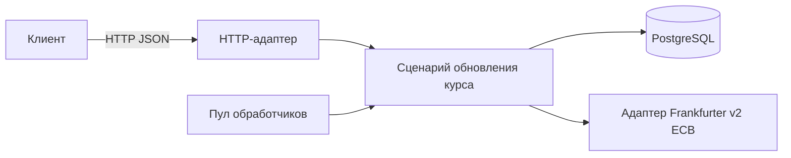
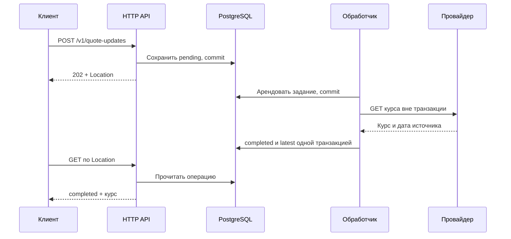
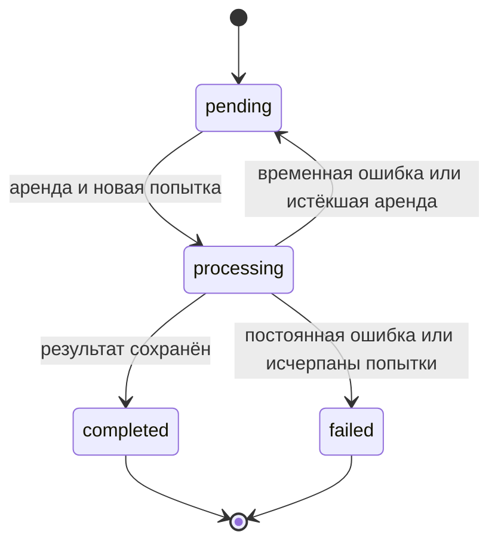
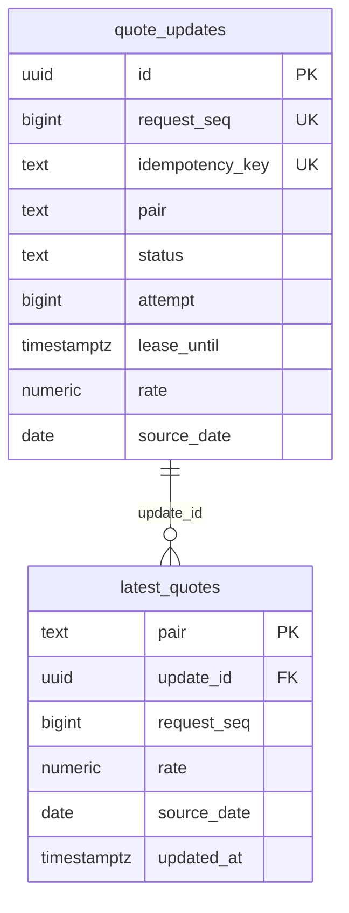

# fx-quotes

Сервис асинхронно получает ежедневные справочные курсы из Frankfurter/ECB, хранит состояние каждой операции и последний успешный результат. Поддерживает шесть направлений: `USD/EUR`, `USD/MXN`, `EUR/USD`, `EUR/MXN`, `MXN/USD`, `MXN/EUR`.

## Запуск

```sh
cp .env.example .env
docker compose up --build
```

В другом терминале:

```sh
curl http://127.0.0.1:8080/health/ready
```

HTTP доступен только на `127.0.0.1:8080`. PostgreSQL хранит данные в именованном томе. Принятые задания сохраняются при `docker compose restart app`.

Для запуска без Docker нужны Go ≥ 1.25.14 и PostgreSQL. Задайте `FX_QUOTES_DATABASE_URL` в окружении, затем выполните `go run ./cmd/fx-quotes`. Само приложение не читает `.env`. По умолчанию оно слушает `127.0.0.1:8080`. В Compose указан адрес `:8080` внутри контейнера.

## API

Создать обновление:

```sh
curl -i http://127.0.0.1:8080/v1/quote-updates \
  -H 'Content-Type: application/json' \
  -H 'Idempotency-Key: example-20260922-1' \
  --data '{"pair":"USD/EUR"}'
```

Ответ `202` содержит `Location`. Подставьте ID и опрашивайте операцию до `completed` или `failed`:

```sh
curl http://127.0.0.1:8080/v1/quote-updates/PUT-THE-ID-HERE
```

Прочитать последний успешный курс:

```sh
curl --get --data-urlencode 'pair=USD/EUR' \
  http://127.0.0.1:8080/v1/quotes/latest
```

Повтор исходного POST с тем же ключом и парой вернёт `200` с прежним ID, не занимая место в очереди. Курс передаётся точной десятичной строкой, без `float64`.

`/health/live` проверяет HTTP-процесс. `/health/ready` дополнительно проверяет БД и возвращает ошибку при остановке сервиса. Продвижение очереди эти маршруты не проверяют.

Форматы, ограничения запросов и ошибки описаны в [OpenAPI](api/openapi.yaml), который сервис отдаёт на [`/openapi.yaml`](http://127.0.0.1:8080/openapi.yaml).

## Архитектура

Домен и прикладные сценарии не зависят от HTTP, PostgreSQL или конкретного провайдера. Адаптеры реализуют интерфейсы, а `internal/app` связывает их через конструкторы. HTTP DTO отделены от домена.



Читать код удобно в таком порядке:

| Каталог                                   | За что отвечает                                                                    |
|-------------------------------------------|------------------------------------------------------------------------------------|
| `internal/entity`                         | Валютные пары, точный курс, состояние операции `QuoteUpdate`                       |
| `internal/usecase/quote`                  | `Service` создаёт и обрабатывает задания. `Store` и `RateProvider` описывают внешние зависимости |
| `internal/adapter/postgres`               | `store.go` принимает и читает задания, `queue.go` управляет обработкой, `row.go` преобразует строки БД |
| `internal/adapter/worker`                 | Пул обработчиков, polling и восстановление                                         |
| `internal/adapter/httpapi`                | `router.go` задаёт маршруты, `handler.go` содержит обработчики, `request.go`/`response.go` отвечают за вход и выход |
| `internal/adapter/frankfurter`            | HTTP-клиент провайдера и проверка его ответа                                       |
| `internal/app`, `cmd/fx-quotes`           | Конфигурация, сборка, запуск и остановка                                           |

### Обработка запроса



Задание сохраняется до уведомления обработчика. Один сигнал будит одного обработчика, восстановление группы заданий будит нескольких. Периодический опрос БД компенсирует потерянные сигналы. Вызов провайдера выполняется вне SQL-транзакции и может повторяться (`at least once`).

Приём защищён транзакционной `advisory lock` между экземплярами с одинаковым `MAX_ACTIVE`. Локальный ограничитель не даёт ожидающим POST занять SQL-пул. Ожидание отменяется HTTP-дедлайном. После блокировки поиск ключа, проверка ёмкости и вставка выполняются одним SQL-запросом.

### Состояния и перезапуск



- Lease и fencing по `attempt` не дают старому владельцу завершить задание после восстановления или нового захвата. Само истечение аренды не запрещает завершение: SQL проверяет статус и попытку.
- Ошибки 408/429/500/502/503/504 и `UnexpectedEOF` повторяются с backoff/jitter в пределах бюджета. Постоянный отказ или исчерпание попыток дают `failed`. Прежний успешный курс сохраняется.
- Фоновые SQL-операции ограничены 1 с, включая ожидание соединения и блокировок. Recovery фиксирует пакеты до 100 строк через `SKIP LOCKED`. После собственного тайм-аута делит размер пакета пополам, вплоть до одной строки. Размер сохраняется до перезапуска. После непустого пакета ждёт `min(POLL_INTERVAL, RECOVERY_INTERVAL)`, после пустого возвращается к обычному интервалу. Недоступная БД или обработка одной строки дольше секунды всё равно задержат восстановление.
- SIGINT/SIGTERM снимает готовность, ждёт HTTP, затем отменяет worker и провайдера. По дедлайну HTTP закрывается принудительно, ожидание БД отменяется. Незавершённые задания восстановятся после истечения аренды.

### Данные



Показаны основные поля. Ограничения и индексы находятся в [миграции](internal/adapter/postgres/migrations/001_quotes.sql). В `latest_quotes` одна строка на пару: результат выбирается по дате источника, затем по порядку приёма запроса. Переходы состояния выполняет PostgreSQL. Интеграционные тесты проверяют их на настоящей БД.

[Frankfurter v2 / ECB](https://frankfurter.dev/docs/) публикует справочные курсы: дата остаётся прежней до новой публикации, включая выходные.

Очередь и результат находятся в одной БД. В текущем сценарии отдельный брокер и outbox не нужны. Сервис рассчитан на одного пользователя. Нет очистки истории и восстановления резервных копий. Публичный запуск требует авторизации, TLS и настройки инфраструктуры. Compose предназначен для локальной работы.

## Настройки

Все переменные собраны в [.env.example](.env.example), допустимые диапазоны проверяет [config.go](internal/app/config/config.go). Основные настройки:

| Переменная                   | По умолчанию | Ограничение                                            |
|------------------------------|--------------|--------------------------------------------------------|
| `FX_QUOTES_WORKER_COUNT`     | `2`          | От 1 до 64                                             |
| `FX_QUOTES_MAX_ACTIVE`       | `100`        | От 1 до 10 000 операций `pending` + `processing`       |
| `FX_QUOTES_MAX_ATTEMPTS`     | `3`          | От 1 до 10 попыток обработки                           |
| `FX_QUOTES_PROVIDER_TIMEOUT` | `5s`         | От `10ms` до `5m`                                      |
| `FX_QUOTES_REQUEST_TIMEOUT`  | `5s`         | От `10ms` до `5m`, включая ожидание БД                 |
| `FX_QUOTES_LEASE_DURATION`   | `15s`        | От `1s` до `10m`, не меньше тайм-аута провайдера + 1 с |

Можно запустить 64 обработчика при SQL-пуле до 16 соединений: во время обращения к провайдеру соединение с БД свободно. Обработчик использует его для захвата задания и фиксации итога попытки. Больше обработчиков не всегда повышает скорость. По умолчанию их два.

- Невалидная конфигурация останавливает запуск. Тайм-аут записи HTTP должен быть больше `REQUEST_TIMEOUT`, чтобы успеть вернуть ошибку.
- `FX_QUOTES_DATABASE_URL` имеет приоритет. Пустой URL запрещён. Без него приложение кодирует URL из компонентов. Для удалённой БД используется `verify-full`. TLS отключён только для loopback IP или точного `DATABASE_INSECURE_HOST`. Compose доверяет своему хосту `postgres`. Явный URL, включая `sslmode=disable`, управляет TLS самостоятельно.
- Порт хоста: `FX_QUOTES_HOST_PORT`. При смене внутреннего порта согласуйте `LISTEN_ADDR`, `CONTAINER_PORT` и `HEALTHCHECK_URL` с префиксом `FX_QUOTES_`. `STOP_GRACE_PERIOD` должен превышать `SHUTDOWN_TIMEOUT`. Примеры есть в `.env.example`.

Логи не содержат реквизитов БД, ключей идемпотентности и тел запросов. Для ошибок записываются безопасная категория и тип, для panic также стек.

## Проверки

```sh
make fmt-check vet test test-race build
TEST_DATABASE_URL='postgres://USER@127.0.0.1:55439/postgres?sslmode=disable' make test-integration
make openapi compose-config compose-load-config
go run golang.org/x/vuln/cmd/govulncheck@v1.1.4 ./...
```

Используйте отдельную тестовую БД. `test-integration` требует URL и отключает кэш. Обычный `go test` без URL пропускает проверки с БД. Проверяются перезапуск, потеря ответа, SQL-дедлайны, 64 обработчика и очередь на 10 000 заданий. В `test/` находятся проверки архитектуры, Compose/smoke и управляемый провайдер для сквозных тестов. В рабочий бинарник они не входят.

Fuzz для курсов и JSON:

```sh
go test ./internal/entity -run '^$' -fuzz FuzzRateRoundTrip -fuzztime 15s
go test ./internal/adapter/httpapi -run '^$' -fuzz FuzzDecodePair -fuzztime 15s
```

CI на PR и push в `main` выполняет форматирование, vet, race/integration, OpenAPI, govulncheck, сборку, проверку Compose и два контейнерных smoke. Лимит выполнения составляет 20 минут. После проверки стенд `fx-quotes-ci` удаляется с данными. Нагрузка, длительный fuzz и production-deployment не входят в CI. Результаты запусков доступны в [GitHub Actions](https://github.com/Timofey121/fx-quotes/actions).

## Нагрузка

Самостоятельный [compose.load.yaml](compose.load.yaml) запускает отдельную БД и тестовый провайдер: 64 обработчика, лимит в 100 активных заданий, порт 18080, курс `0.9234` с задержкой `100ms`. Обычные URL БД и провайдера не используются. Не объединяйте этот файл с `compose.yaml` и не запускайте нагрузку одновременно со сборкой или fuzz.

```sh
docker compose -p fx-quotes-load -f compose.load.yaml up --build -d --wait
FX_QUOTES_SMOKE_URL=http://127.0.0.1:18080 FX_QUOTES_SMOKE_EXPECTED_RATE=0.9234 make smoke
k6 run -e FX_QUOTES_K6_BASE_URL=http://127.0.0.1:18080 \
  -e FX_QUOTES_K6_START_RATE=100 -e FX_QUOTES_K6_TARGET_RATE=100 \
  -e FX_QUOTES_K6_RAMP_DURATION=1s -e FX_QUOTES_K6_STEADY_DURATION=30s \
  -e FX_QUOTES_K6_RAMP_DOWN_DURATION=1s \
  -e FX_QUOTES_K6_PREALLOCATED_VUS=100 -e FX_QUOTES_K6_MAX_VUS=200 \
  k6/scripts/async-quotes.js
docker compose -p fx-quotes-load -f compose.load.yaml down
```

`down` сохраняет том, `down -v` удаляет данные. Указывайте `-p fx-quotes-load`, чтобы не затронуть другой проект. Smoke требует `curl` и `jq`.

Профиль `FX_QUOTES_K6_PROFILE`: `load` по умолчанию, `smoke` для шести пар и повтора, `stress` для переполнения очереди. Параметры и метрики находятся в [сценарии k6](k6/scripts/async-quotes.js), настройки стенда в [.env.example](.env.example).

Пороги `load`: p95 POST < 250 мс, полного успешного сценария < 3 с, HTTP < 500 мс. Допускается менее 1% HTTP-ошибок, при этом должны завершиться все операции, без неожиданных ошибок и пропусков генератора. Это критерии локального стенда, не SLA. Результаты зависят от окружения. Публичный API нагрузкой не проверяется.

## Принятые решения

Исходные условия: один пользователь, шесть валютных пар, сохранение заданий после перезапуска. Асинхронное обновление обязательно по ТЗ. Механизм очереди, источник курсов и правила повторов выбраны в реализации. Требований к промышленной нагрузке и SLA в ТЗ нет.

| Что выбрано | Почему | Ограничение | Когда выбрал бы иначе |
| --- | --- | --- | --- |
| Clean Architecture, небольшие интерфейсы и ручная сборка зависимостей | Сценарии не зависят от HTTP, SQL и конкретного провайдера. Зависимости можно подменять в тестах | Больше типов и переходов между файлами, чем в одном пакете | Для одноразового прототипа хватило бы меньшего числа слоёв. Отдельные сервисы рассмотрел бы при независимом масштабировании или разделении ответственности между командами |
| PostgreSQL хранит очередь и результаты, без брокера и outbox | Принятое задание переживает перезапуск. Завершение и latest фиксируются одной транзакцией | БД обслуживает и запросы, и очередь. Приём сериализован общей блокировкой | При измеренном пределе производительности очереди или необходимости рассылать события независимым системам рассмотрел бы брокер. Запись в БД и публикацию согласовал бы через outbox |
| Канал уведомления и периодический опрос БД | Уведомление сокращает задержку, опрос находит задания при потере сигнала | Пустая очередь всё равно создаёт SQL-запросы. Канал без БД не переживает падение | При заметной нагрузке от пустых опросов рассмотрел бы LISTEN/NOTIFY с резервным опросом |
| Ограниченный пул обработчиков и лимит активных заданий | Можно настроить параллелизм и число принятых заданий. При переполнении новый POST получает отказ | Новые задания при полной очереди получают 503. Поддержка 64 обработчиков не гарантирует прирост скорости | Параллелизм и лимиты подбирал бы по замерам. При квотах провайдера добавил бы ограничение частоты запросов |
| Необязательный Idempotency-Key с уникальностью в БД | Повтор с тем же ключом и парой после потери HTTP-ответа возвращает прежнюю операцию | Без ключа создаётся новое задание. Ключи хранятся вместе с историей без срока удаления | Для нескольких пользователей уникальность ключа ограничил бы владельцем. Срок хранения зависел бы от согласованного окна повторов |
| Аренда задания и проверка номера попытки при записи | После падения работу можно повторить, а прежний обработчик не перезапишет результат нового | Запрос к провайдеру может выполниться повторно. Восстановление ждёт истечения аренды и прохода recovery | Для долгих задач понадобилось бы продление аренды. Для внешних списаний или отправок дополнительно нужна идемпотентность получателя |
| Ограниченные повторы с backoff и jitter | Временный сбой не завершает операцию сразу. Повторы распределены во времени | Результат приходит позже, а продолжительный отказ исчерпывает попытки | При длительных массовых отказах рассмотрел бы circuit breaker и другие интервалы на основе требований к задержке |
| Точная десятичная строка в Go и NUMERIC(30,15) в БД | Курс сохраняется без погрешности float64 | Поддерживается заданный диапазон, арифметики над курсами нет | Для расчётов сумм потребовались бы десятичная арифметика и правила округления. Для иной точности изменились бы домен, БД и API |
| latest выбирается по source_date, затем request_seq | Поздний ответ со старой датой не затирает более свежий курс | Последняя завершившаяся операция не обязательно становится latest. Правило зафиксировано в контракте | Если бизнесу нужен результат последнего завершения, изменил бы правило выбора и тесты |
| Справочные курсы Frankfurter/ECB | Подходят для ограниченного набора валют в задании | Это ежедневные данные, не поток торговых цен. Свежесть зависит от публикации источника | Для торговых или внутридневных котировок нужен источник с нужной частотой, условиями использования и гарантией доступности |
| Unit-тесты, настоящая PostgreSQL и управляемый провайдер для нагрузки | Можно воспроизвести блокировки, сбои и повторы, не нагружая публичный API | Локальный стенд не доказывает доступность провайдера и production SLA | Для эксплуатации добавил бы проверки внешнего контракта, мониторинг очереди и измерения на целевом окружении |
